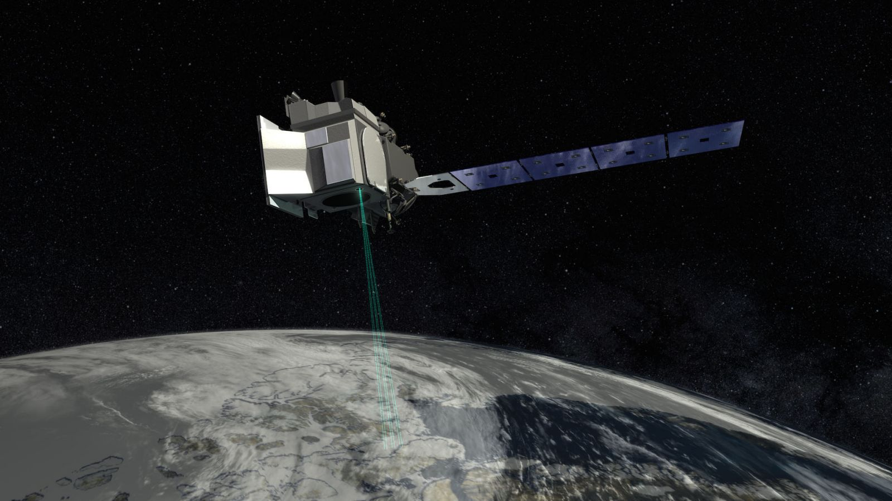
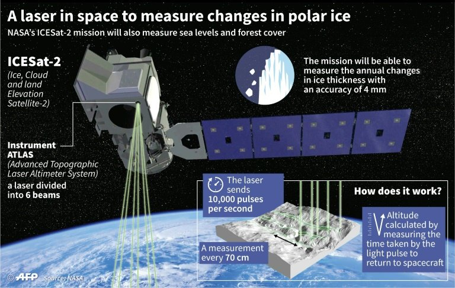
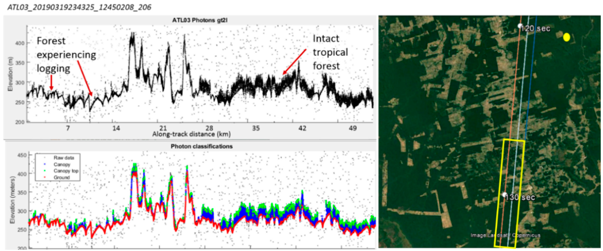
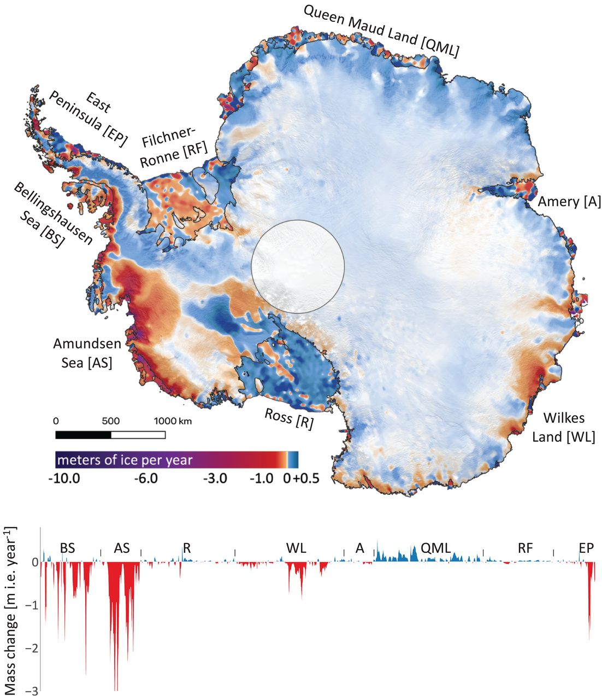

.center[# Facts about ICESat-2 satellite
]

* Ice, Cloud, and Land Elevation Satellite-2 launched by NASA

* Launched at 15 September 2018

* Currently in services at its "Cycle 22" 

* Previous generation is ICESat which decommissioned from operations on 14 August 2010


```{r echo=FALSE, out.width='50%', fig.align='center'}


```

.center[Source: [Original from Satellie Missions Catalogue -- ICESat-2](https://www.eoportal.org/satellite-missions/icesat-2#references)
]

---
.center[# Missions and visions
]

* To monitor mass balance in:
  * Cryosphere -- topography and volume of ice sheets, glaciers, and sea ice
  
  * Hydrosphere -- terrestial water body e.g., lake, sub- and supraglacial lake, ocean dynamics e.g., ocean surface height and circulation
  
  * Biosphere -- vegetation/ canopy cover (biomass)

* To provide open data source at 3 levels for the NASA National Snow and Ice Data Center Distributed Active Archive Center  [NSIDC DAAC](https://nsidc.org/data/data-programs/nsidc-daac)


```{r echo=FALSE, fig.align='center'}
knitr::include_url("https://www.youtube.com/embed/kanl64Yx5VI", height='30%')
```

---
.center[# Operations and resolutions 
]

* Active sensors -- Six-beam Advanced Topographic Laser Altimeter System (ATLAS) on-board

* Measures the returning time of the laser signal to determine the distance between ICESat-2 and ground surface, thus, topography

* ATLAS sends out 10000 pulses per second of laser lights at 532 nanometers and bright green visible spectrum


```{r echo=FALSE, out.width='50%', fig.align='center'}

```
.center[Graphic illustration of the functining of ICESat-2
]
---
.center[# Operations and resolutions 
]

### Spatial resolutions

* Gridded Antarctic & Arctic Land Ice Height: 100m x 100m

* Gridded Antarctic & Arctic Land Ice Height Change: 40km x 40km

* Monthly Gridded Dynamic Ocean Topography: 25km x25km

### Orbiting

* Spatial reference system: WGS 84 (EPSG:4326)

* Altitude: 310 miles (around 500 km)

* Inclination: 92-degree

* Speed: 15660 miles/hour (7 km/second)

* Duration for completing one cycle: 91 days

---
.center[# Achievements of ICESat-2
]

.center[ ## A pioneer in remote sensing -- six-beam ATLAS
]

* NASA's first photon-counting laser altimeter

* Six beams allow measurement of slope changes; highly sensitive photons allow more precise measurement of (annual) changes in cryosphere

* Go beyond the ice -- also quantify changes in biosphere e.g., vegetation cover (biomass) 

```{r echo=FALSE, out.width='50%', fig.align='center'}
knitr::include_graphics('ICESat-2_how-it-works.jpg')
```
---
.center[# Research collections using ICESat-2
]

.pull-left[
### Canopy cover 

* The application of ICESat-2 in monitoring changes in biomass especially places with active deforestation and forests that require conservation.


```{r echo=FALSE, out.width='100%', fig.align='center'}

```
[Neuenschwander ahd Magruder, 2019](https://www.mdpi.com/2072-4292/11/14/1721)
]

.pull-right[
### Interactions between cryosphere and hydropshere

* Quantifying the changes in mass balance -- gain (accumulation) and loss (ablation) over ice sheets and glaciers in Greenland and Antarctica.

```{r echo=FALSE, out.width='40%', fig.align='center'}

```
[Smith et al., 2020](https://www.science.org/doi/10.1126/science.aaz5845)
]

---
.center[# Reflections
]

* The availability of ICESat-2 facilitated our understanding towards changes in cryosphere e.g., inter-annual cycle changes especially under rapid climate change

* It allows the monitoring of cryosphere in remote areas in the Arctic areas and the Antarctica which are not accessible for human for all-year-round


* The processed products (data) from ICESat-2 allows comprehensive understanding of land ice, sea ice, the atmosphere, vegetation cover, oceans, and terrestrial water body e.g., exchange of masses, mass balance in different spheres (cryosphere, biosphere, and hydrosphere -- both terrestrial and ocean water mass)

* The enhanced precision of ICESat-2 allows better modelling and predictions of ablation of ice sheets and ice bergs dynamics. This is extremely important in West Antarctica where there are many unstable ice bergs and marine-based ice sheet that are sensitive to warm ocean basal melting. 

---
.center[# Reflections
]

* The 91-day cycle (at around 3 months) allows the capture of changes in seasonal scale, this allows comparisons at different temporal scales -- seasonally, inter-annually, and annualy. The temporal coverage is quite high.

* Open data sources also enhances the reproducibility of data to facilitate collaboration of research and civic participation in polar research


* Variation of spatial resolution in different products deteriorates research quality. Some of the spatial resolutions are high e.g., land height in Arctic and Antarctic at 100m x 100m. However, resolutions of some of the products are still low e.g., changes in topography of ice mass in Arctic and Antarctic at 25km x 25km. It is too coarse to quantify changes.

```{r echo=FALSE, out.width='30%', fig.align='center'}
knitr::include_graphics('icesat2-logo_0.webp')
```
---
.center[# References
]
---


